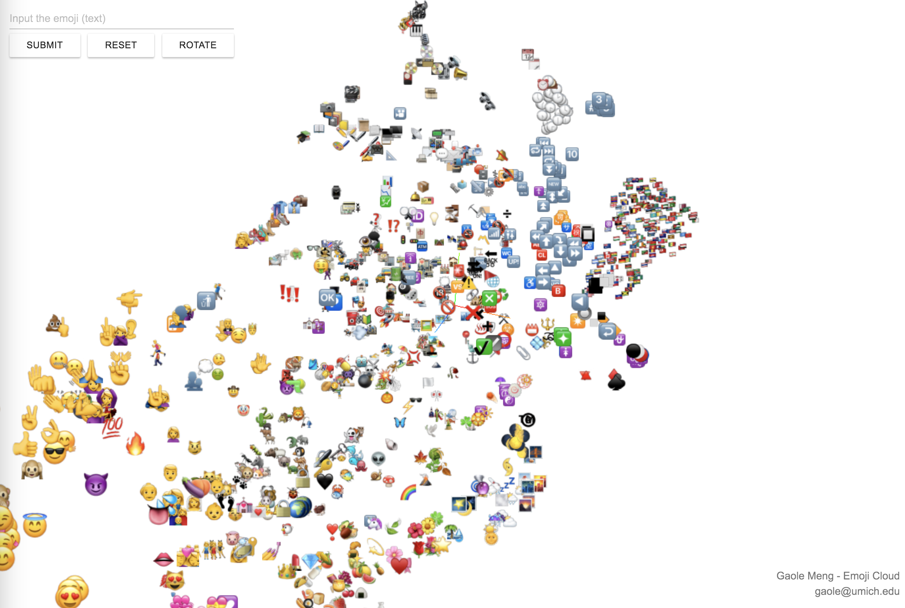
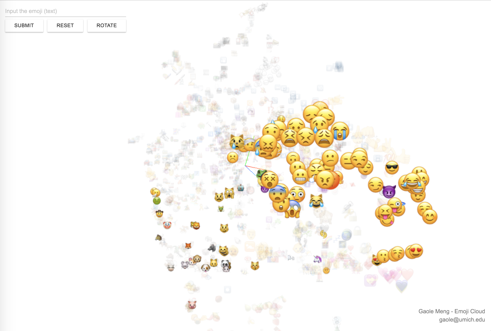

# emoji-cloud-heroku
The deployed version of emoji-cloud
The demo is here: https://emojicloud3d.herokuapp.com/
The emoji with similar meaning will be  clusted together.
Using LargeVis plus word2vec.

You can now search the emoji you want to check with a simple search bar:

